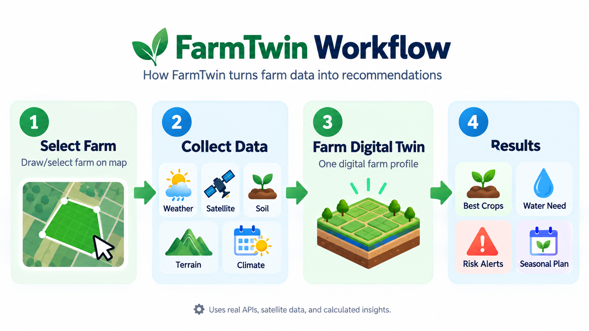

# 🌱 FarmTwin

**Understand your farm before you plant.**

FarmTwin is a climate-smart agricultural decision-support platform that combines **real weather, satellite, soil, terrain, and climate data** to create a digital environmental profile of a farm.

It helps farmers answer practical questions such as:

* What crops are suitable for my land?
* Is rainfall sufficient for this crop?
* How much water might it need?
* What climate risks should I prepare for?
* What should I plant throughout the year?

---

## 🌍 The Problem

Farmers around the world make critical decisions about crops, planting periods, water, and climate risks.

However, the information needed to make these decisions is often scattered across **weather services, satellite systems, soil databases, climate datasets, and terrain models**.

FarmTwin brings these signals together and converts them into **farm-specific, explainable recommendations**.

### 📊 Why This Matters

Climate and disaster events create major agricultural losses worldwide.

According to the **UN Food and Agriculture Organization (FAO)**, disasters caused approximately **$3.8 trillion in crop and livestock production losses over the last 30 years — around $123 billion per year on average**.

FarmTwin was built around a simple idea:

> **Environmental data already exists. The challenge is turning it into useful decisions for an individual farm.**

---

## 💡 How FarmTwin Works

1. Draw or select a farm on the map.
2. FarmTwin identifies the farm's geographic area.
3. Environmental data is collected for that location.
4. The data is combined into a **Farm Digital Twin**.
5. Decision engines analyze crop suitability, water requirements, and climate risks.
6. FarmTwin generates recommendations and an annual crop plan.



```text
Select Farm
     ↓
Collect Environmental Data
     ↓
Farm Digital Twin
     ↓
Crop + Risk + Planning Engines
     ↓
Farm Recommendations
```

---

## 🛰️ Real Environmental Data

FarmTwin combines multiple environmental data providers:

| Data      | Source         | Used For                                        |
| --------- | -------------- | ----------------------------------------------- |
| Weather   | Open-Meteo     | Temperature, rainfall, wind and forecasts       |
| Satellite | Sentinel-2     | NDVI vegetation health and NDMI moisture        |
| Soil      | SoilGrids      | pH, texture, organic carbon and soil properties |
| Terrain   | Copernicus DEM | Elevation and slope                             |
| Climate   | ERA5-Land      | Historical climate patterns and anomalies       |
| Station   | Conduit IoT    | Local sensor measurements when available        |

Each observation keeps its **source, timestamp, spatial resolution, availability, and quality status**.

Missing environmental data is not silently fabricated.

---

## 🧬 Farm Digital Twin

FarmTwin combines the environmental information for a farm into one unified profile.

```text
Weather + Satellite + Soil + Terrain + Climate + Sensors
                           ↓
                  Farm Digital Twin
```

This Digital Twin becomes the input for FarmTwin's decision engines.

---

## 🌾 Crop Suitability Engine

The Crop Engine compares actual farm conditions against the requirements of **20+ crops**.

It evaluates factors such as:

* Temperature
* Rainfall
* Soil pH and texture
* Elevation and slope
* Seasonal climate conditions

Example:

```text
Maize Suitability: 82/100

Temperature     ✓ Suitable
Soil            ✓ Suitable
Terrain         ✓ Suitable
Rainfall        ⚠ Below optimal

Main limitation: Water availability
```

The scoring system is **rule-based and transparent**, allowing users to understand why a crop received its score.

---

## 💧 Climate Risk & Water Analysis

FarmTwin analyzes agricultural risks such as:

* Drought
* Heat stress
* Heavy rainfall
* Flood / waterlogging conditions
* Wind exposure
* Seasonal rainfall anomalies

It also compares expected rainfall against crop water requirements.

```text
Crop water requirement: 420 mm
Expected rainfall:       310 mm
Estimated deficit:       110 mm
```

This helps identify potential water shortages and climate risks before planting.

---

## 📅 Annual Crop Planner

FarmTwin combines:

**Crop suitability + planting seasons + rainfall + growing duration + crop rotation**

to generate a practical **12-month crop plan**.

```text
Mar – Jun   → Maize
Jul – Sep   → Vegetables
Oct – Dec   → Beans
```

The plan adapts to the environmental conditions of the selected farm rather than assuming one fixed agricultural calendar for every location.

---

## 🤖 AI Explanations

AI is used to explain calculated results in simple language.

It **does not calculate crop suitability scores or climate-risk values**.

```text
Environmental Data
        ↓
Rule-Based Engines
        ↓
Calculated Results
        ↓
AI Explanation
```

This keeps the core decision process transparent and auditable.

---

## 🏗️ Tech Stack

**Frontend**

* Next.js / React 19
* TypeScript
* Tailwind CSS
* MapLibre GL JS

**Backend**

* FastAPI
* Python 3.12
* PostgreSQL + PostGIS
* Redis
* Pydantic

**Infrastructure & Testing**

* Docker / Docker Compose
* Pytest
* Hypothesis

---

## ✨ Main Features

* Interactive farm boundary selection
* Farm Digital Twin
* 6 environmental data integrations
* Sentinel-2 NDVI / NDMI analysis
* 20+ crop suitability simulations
* Water requirement analysis
* Climate and disaster risk assessment
* 12-month crop planning
* Data provenance and quality tracking
* AI-generated explanations

---

## 🐳 Run with Docker

```bash
git clone <repository-url>
cd farmtwin

cp backend/.env.example backend/.env

docker compose build
docker compose up -d
```

Open:

```text
Frontend:  http://localhost:3000
API:       http://localhost:8000
API Docs:  http://localhost:8000/docs
```

Stop:

```bash
docker compose down
```

---

## ⚠️ Accuracy & Limitations

FarmTwin is a **decision-support system**, not a replacement for laboratory soil testing, field measurements, or professional agronomic advice.

Environmental datasets have different spatial resolutions and uncertainty. SoilGrids provides modeled soil properties, forecasts can change, and satellite observations can be affected by cloud cover and acquisition timing.

FarmTwin reports data provenance and availability so uncertain or missing information is not presented as confirmed farm measurements.

---

## 🎯 Goal

FarmTwin's goal is to make environmental intelligence useful at the **individual farm level — anywhere supported environmental data is available**.

> **What should I grow? When should I grow it? How much water might it need? And what environmental risks should I prepare for?**

---

**FarmTwin — Understand your farm before you plant.**

*Better data. Better decisions. More resilient farms.*
